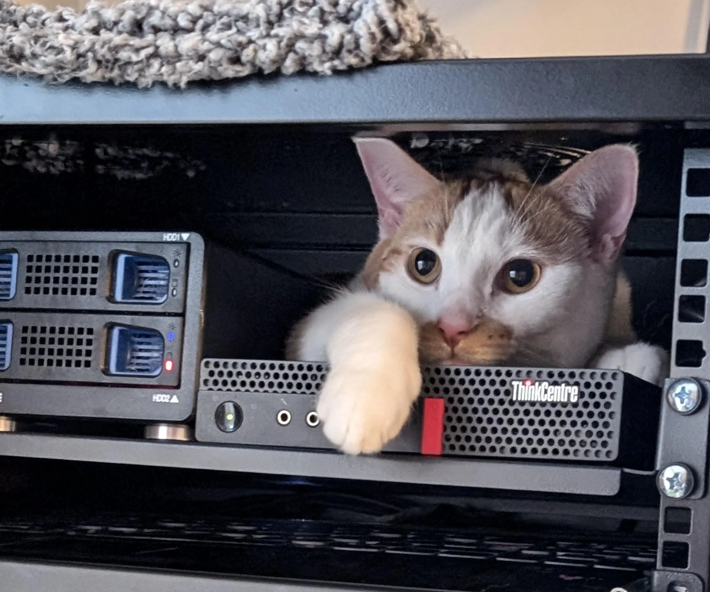

# Tech_Selectel  
---  
## Техническое задание на позицию "Системный администратор"  

#### Содержание:
1. [Задание 1](Task_1/log.bash)
2. [Задание 2](Task_2/lsof.sh)
3. [Задание 3](Task_3/Rep.md)
4. [Задание 4](Task_4/Docker.md)
5. [Задание 5](Task_5/Nginx.md)
6. [Задание 6](Task_6/Kuber.md)
7. [Задание 7](Task_7/Decision.md)

