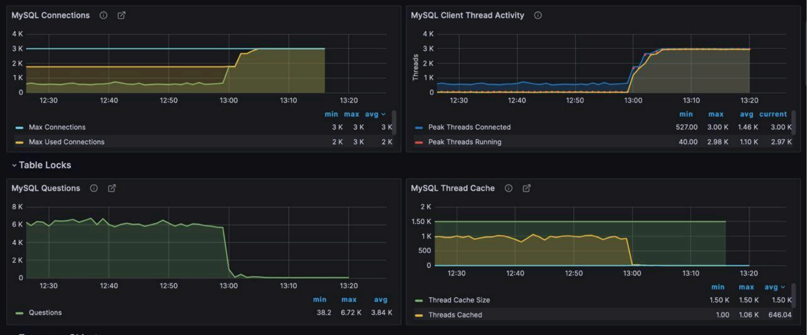

# Причина недоступности сервиса MySQL  
---  
Согласно дашбордам, на мой взгляд, сервис MySQL подвергся DDoS-атаке.  
На 1 и 2 дашборде видно резкое и максимальное количество пользовательских подключений, при том, что на 3 и 4 дашбордах с запросами и кешем, видно, что авктивность резко улетела в ноль. Соответственно, из-за нагрузки сервис стал не достпен.  
Судя по последнему обновлённому времени, сервис недоступен 15-20 минут, так как упал приблизительно в 13:00-13:05 и в 13:20 всё ещё не поднят.  
